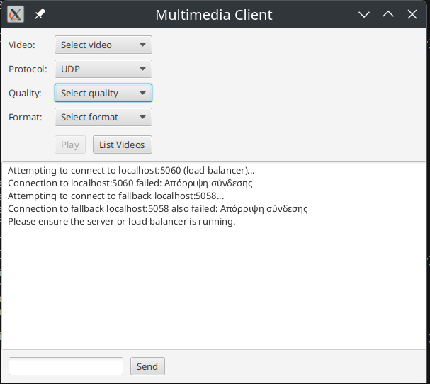
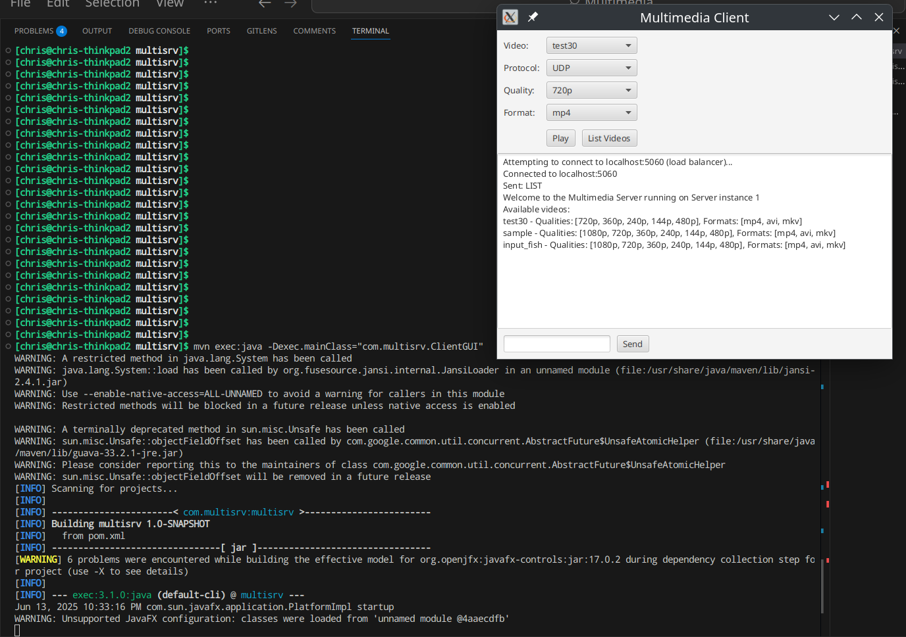
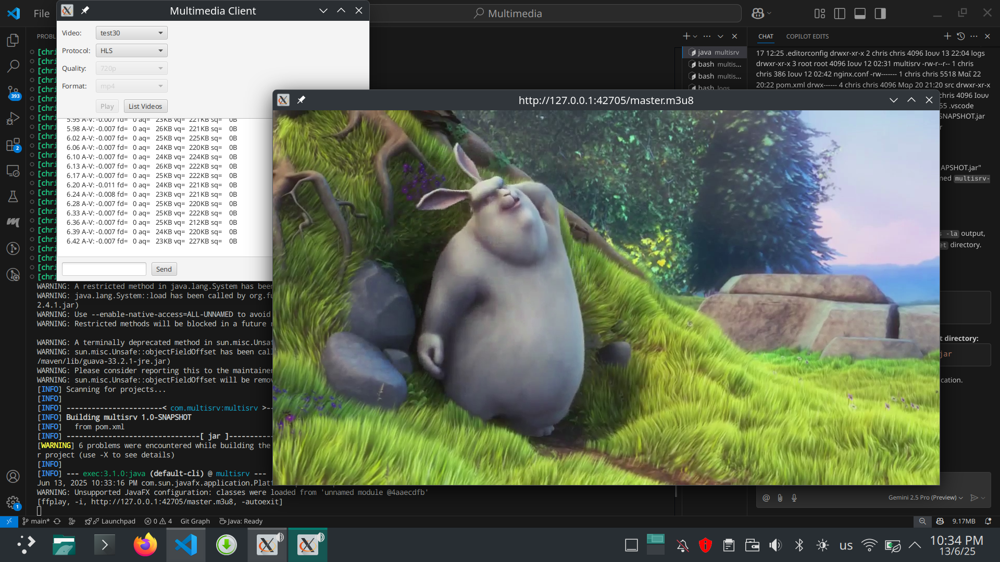

= Εργασια Multimedia Streaming
Χρήστος Βρέκος (Α.Μ. 21390027)
:hide-uri-scheme:
:doctype: book
:icons: font
:source-highlighter: pygments
:pygments-style: manni
:pygments-linenums-mode: inline
:toc: left
:toc-title: Πίνακας περιεχομένων
:toclevels: 4
:sectlinks:
:sectanchors:
:pdf-style: basic
:pdf-fontsdir: fonts/
:pdf-stylesdir: styles/

== Aρχιτεκτονική του Συστήματος

*Περιγραφή του συστήματος και των λειτουργιών του:* + 
Το σύστημα αποτελείται από δύο κύριες εφαρμογές οι οποιες χωριζονται σε 4 κλασεις ωστε ο κωδικας να ειναι πιο οργανωμένος και κατανοητός

=== Streaming Server

O streaming server υλοποιηθηκε ωστε να μπορει να υποστηρίζει πολλους clients ταυτοχρονα και να ειναι multithreaded. Ο server ειναι υπευθυνος για την διαχειριση των βιντεο και την μετατροπη τους σε διαφορετικες αναλυσεις και φορμες μεσω του FFmpeg. Επικοινωνει με τον client μεσω Java Sockets και εχει τις εξης κλασεις:    

==== Server.class
Υλοποιεί την κλάση του server, διαχειρίζεται τις συνδέσεις και τις ροές δεδομένων (input/output streams).

Συγκεκριμενα χρησιμοποιεί thread pool για να μπορει να διαχειριζεται πολλαπλους clients ταυτοχρονα. Ο server μπορει να γινει initiate σε οποια πορτα θελουμε με την default να ειναι η 5058.Αυτο γινεται ωστε να υπαρχει δυνατοτητα λειτουργειας load balancing με την εκτελεση πολλαπλων server σε διαφορετικες πορτες και παρακατω φενεται ο κωδικας που μας δινει την δυνατοτητα αυτη.
[source,java]
----
    private static final String DEFAULT_SERVER_ID   = "1";
    private static final String DEFAULT_SERVER_PORT = "5058";
    private static final String DEFAULT_VIDEO_PATH  = "/home/chris/OneDrive/Documents/8o examino/Multimedia/multisrv/videos";
    private static final String DEFAULT_FFMPEG_PATH = "/usr/bin";
    public static final String SERVER_ID   =
            System.getenv().getOrDefault("SERVER_ID", DEFAULT_SERVER_ID);

        public static final int SERVER_PORT   =
            Integer.parseInt(System.getenv().getOrDefault("SERVER_PORT", DEFAULT_SERVER_PORT));

        public static final String VIDEO_PATH =
            System.getenv().getOrDefault("VIDEO_PATH", DEFAULT_VIDEO_PATH);

        public static final String FFMPEG_PATH =
            System.getenv().getOrDefault("FFMPEG_PATH", DEFAULT_FFMPEG_PATH);

----
Επειτα απο την δημιουργία του socket εκετελειτε η function initialize του VideoManager και μετα ο Server αναμενει connections απο τους clients. Οταν ενας client συνδεθεί, με την χρηση της συναρτησης handleNewConnection αποδεσμευει σε ενα Thread τον Client με την κλάση ClientHandler. Οταν ο client αποσυνδεθεί, η χρηση ενος anonymous class που υλοποιει το Runnable interface, καλεί την συναρτηση disconnectCallback.run() και ετσι μπορουμε να μειωσουμε τον αριθμο των ενεργων συνδεσεων. Εδω γινεται χρηση ενος atomic integer για να μπορουμε να εχουμε ταυτόχρονες προσβάσεις απο πολλα instaces χωρις να υπαρχει race condition.

[source,java]
----
    private static final AtomicInteger activeConnections = new AtomicInteger(0);
    ....
                 clientPool.submit(new ClientHandler(clientSocket, input, output, videoManager, () -> {
                activeConnections.decrementAndGet();
                System.out.println("Client disconnected. Active connections: " + activeConnections.get());
            }));
----
Τελος η κλάση Server εχει και την συναρτηση shutdownHook που ειναι υπευθυνη για την ομαλη διακοπη του server και την απελευθερωση των πόρων του.

[source,java]
----
 private static void registerShutdownHook() {
        Runtime.getRuntime().addShutdownHook(new Thread(() -> {
            logger.info("Shutting down server...");
            clientPool.shutdown();
            try {
                if (!clientPool.awaitTermination(5, TimeUnit.SECONDS)) {
                    clientPool.shutdownNow();
                }
            } catch (InterruptedException e) {
                clientPool.shutdownNow();
            }
            logger.info("Server shutdown complete");
        }));
    }
----                    
==== ClientHandler.class
Υλοποιεί την κλάση που διαχειρίζεται τις συνδέσεις με τους πελάτες, επεξεργάζεται τις εντολές και στέλνει τα δεδομένα (Streaming).

Η κλάση αυτη ειναι υπευθυνη για την διαχείριση των clients και την επεξεργασία των εντολών τους. Οταν ο client συνδεθεί, η κλάση ClientHandler αναλαμβάνει να διαχειριστεί την επικοινωνία με τον client. H κλάση ClientHandler εχει την συναρτηση processCommand που ειναι υπευθυνη για την επεξεργασία των εντολών του client απο το Terminal. Οταν ο client στείλει μια εντολή, η κλάση ClientHandler θα την επεξεργαστεί και θα επιστρέψει τα αποτελέσματα στον client. Η κλάση αυτη καλει συναρτησεις της κλασης VideoManager για να παρουσιασει την λιστα με τα διαθεσιμα βιντεο στον client.H  proccessCommand διαχειριζεται εντολες τυπου CLI εφοσων η αρχικη υλοποιηση του client ηταν ενα terminal executable. Οταν αναπτυχθυκε το GUI, για την απλοτητα τησ εφαρμογης, διατηρηθηκε η επικοινωνεια με τις εντολες τυπου CLI μεσα απο το Java socket. Η οποια πειρεχει 3 εντολες: 

- LIST: Επιστρέφει την λίστα με τα διαθέσιμα βίντεο εκτελοντας την συναρτηση getVideoList του VideoManager.
- GET <video_name>: Επιστρέφει πληροφορίες για το συγκεκριμένο βίντεο εκτελοντας την συναρτηση playVideo του getVideoInfo.
- PLAY <video_name> <quality> <format>: Ξεκινάει την ροή του συγκεκριμένου βίντεο με την επιλεγμένη ποιότητα εκτελοντας την συναρτηση playVideo του VideoManager .
- Bye: Κλείνει την σύνδεση με τον server.
                    
==== VideoManager.class 
Υλοποιεί την κλάση που διαχειρίζεται τα βίντεο, τις μετατροπές και τις ροές.
       
Η κλαση αυτη ειναι υπευθυνη για την διαχείριση των βίντεο και την μετατροπή τους σε διαφορετικές αναλύσεις και formats μεσω του FFmpeg. Η κλάση VideoManager επισης βοηθεια με getters ωστε να μπορουμε να εχουμε πληροφορίες για τα βίντεο που εχουμε δημιουργησει. Τα οποια χρησιμοποιουνται απο την κλάση ClientHandler για να παρουσιασουν την λιστα με τα διαθεσιμα βιντεο στον client.

===== Initialize()

Η πρωτη συναρτηση που καλείται ειναι η initialize που φορτώνει τα βίντεο απο τον καταλογο που του δινουμε και τα αποθηκευει σε μια λιστα. Επειτα κανει ελεγχω για ποιος συνδιασμος απο τα προτοκολλα και αναλυσης που υποστηριζει η εφαρμογη μας δεν υπαρχουν στην λιστα αλλα μονο για αναλυσησεις μικροτερεσ τησ αρχικησ που βρεθηκε. Ετσι μπορει να δημιουργησει τα βίντεο που λειπουν με την συναρτηση analyzeMissingFormats. Η σειρα κλησεων ειναι η εξης: indexVideoFiles → analyzeMissingFormats → generateAllHLSPlaylists → indexVideoFiles

[source,java]

----
public void initialize() {
        logger.info("Initializing video manager...");
        File videoDir = getVideoDirectory();
        
        if (videoDir == null) {
            logger.error("Failed to initialize video manager");
            return;
        }
        
        // First index videos, then analyze and create missing formats
        indexVideoFiles(videoDir);
        analyzeMissingFormats();
        // Generate HLS playlists for all videos
        generateAllHLSPlaylists();
        // Re-index after all operations
        indexVideoFiles(videoDir);
        logger.info("Video manager initialized successfully");
    }
----

===== File Locks

Η κλάση VideoManager εχει και συναρτησεις  που ειναι υπευθυνες για την διαχειριση των File Lock και την αποφυγή ταυτόχρονων προσβάσεων στα βίντεο. Αυτη υλοποιηθηκαν ωστε να υπαρχει δυνατοτητα εκτελεσεις πολλαπλων instances του server, οι οποιοι κανουν Load balance μεταξυ τους.
       
Ετσι οταν ενας server θελει να μετατρεψει ενα βιντεο σε μια συγκεκριμένη αναλυση και φορματ, καλεί την συναρτηση acquireLock και αν το lock εχει αποκτηθεί, τοτε προχωραει στην μετατροπή του βίντεο. Αν το lock δεν εχει αποκτηθεί, τοτε η συναρτηση επιστρέφει false και ο server δεν προχωραει στην μετατροπή του βίντεο. Ετσι αποφεύγουμε ταυτόχρονες προσβάσεις στα βίντεο και διασφαλιζουμε την ακεραιοτητα τους. Παρακατω υπαχει ενα παραδειγμα απο δοκιμη που εγινε με docker ωστε να τρεξουμε παραλληλα 2 instances του servrer και να δουμε οτι δεν υπαρχει προβλημα με τα File Lock και για τις αναγκεσ load balancing της εφαρμογης:
[source,console]
----
multimedia-server-1-1  | ANALYZING MISSING FORMATS THAT COULD BE CREATED WITH FFMPEG:
multimedia-server-1-1  | 23:32:37.248 [main] INFO  com.multisrv.VideoManager -   Missing: input_fish-144p.avi
multimedia-server-1-1  | 23:32:37.251 [main] INFO  com.multisrv.VideoManager - Converting: input_fish-1080p.mp4 -> input_fish-144p.avi
multimedia-server-2-1  | 23:32:37.253 [main] INFO  com.multisrv.Server - Server 2 running on port 5059
multimedia-server-2-1  | ANALYZING MISSING FORMATS THAT COULD BE CREATED WITH FFMPEG:
multimedia-server-2-1  | 23:32:37.268 [main] INFO  com.multisrv.VideoManager -   Missing: input_fish-144p.avi
multimedia-server-2-1  | 23:32:37.269 [main] INFO  com.multisrv.VideoManager - Conversion already in progress by another instance: input_fish-144p.avi    
----
===== FFMPEG Transcoding
Εκτος απο την διχειρειση των lock files η κλαση VideoManager θεωρειται το βασικο backend τις streaming εφαμογης μας στο Server side. Αρχικα φορτώνει τα βίντεο απο τον καταλογο που του δινουμε και τα αποθηκευει σε μια λιστα.
[source,java]
----
videoQualities.computeIfAbsent(baseName, k -> ConcurrentHashMap.newKeySet()).add(quality);
videoFormats.computeIfAbsent(baseName, k -> ConcurrentHashMap.newKeySet()).add(format);
----
Εδω γινεται χρηση των ConcurrentHashMap ετσι ωστε να μπορουμε να εχουμε ταυτόχρονες προσβάσεις απο πολλα instaces χωρις να υπαρχει race condition.  
Επειτα κανει ελεγχω για ποιος συνδιασμος απο τα προτοκολλα και αναλυσης που υποστηριζει η εφαρμογη μας δεν υπαρχουν στην λιστα αλλα μονο για αναλυσησεις μικροτερεσ τησ αρχικησ που βρεθηκε.
[source,java]
----
public void analyzeMissingFormats() {
....
String highestQuality = findHighestQuality(videoQualities.get(videoName));
....
}
private String findHighestQuality(Set<String> qualities) {
        int highestIndex = -1;
        String highestQuality = null;
        for (String quality : qualities) {
            int index = supportedQualities.indexOf(quality);
            if (index > highestIndex) {
                highestIndex = index;
                highestQuality = quality;
            }
        }
        return highestQuality;
    }
----

Επειτα εχουμε ενα αποσπασμα της διαδικασιας δημιουργιας των βιντεο που λειποουν. Καποια μερη των σηναρτησεων παραληπονται για ευαναγνωσία.:
[source,java]
----
public void analyzeMissingFormats() {
....
  for (int i = 0; i <= highestQualityIndex; i++) {
                String quality = supportedQualities.get(i);
                for (String format : supportedFormats) {
                    if (!videoExists(videoName, quality, format)) {
                        logger.info("  Missing: {}-{}.{}", videoName, quality, format);
                        generateVideoFormat(videoName, quality, format, highestQuality);
                        ....
                    }
public void generateVideoFormat(String videoName, String targetQuality, String targetFormat, String sourceQuality) {
        if (videoExists(videoName, targetQuality, targetFormat)) {
        ....
        if (!acquireLock(videoName, targetQuality, targetFormat)) {
        ....
        try {
            File videoDir = getVideoDirectory();
            String sourceFormat = findBestSourceFormat(videoName, sourceQuality);
            
            if (sourceFormat == null) {
                logger.error("No suitable source format found for {}", videoName);
                return;
            }
            
            File sourceFile = new File(videoDir, videoName + "-" + sourceQuality + "." + sourceFormat);
            File targetFile = new File(videoDir, videoName + "-" + targetQuality + "." + targetFormat);
            
            logger.info("Converting: {} -> {}", sourceFile.getName(), targetFile.getName());
            transcodeFFMPEG(sourceFile, targetFile, targetQuality);
            
            if (targetFile.exists()) {
                logger.info("Conversion successful: {}", targetFile.getName());
                parseVideoFile(targetFile.getName());
            }
----
Τελος η transcodeFFMPEG ειναι η συναρτηση που καλει το FFmpeg μεσω του Jaffree για να κανει την μετατροπη του βίντεο. Καποια μερη της περιλαβανονται στο παρακατω αποσπασμα οπως η μεταφορα του πινακα με τις αναλογιες bitrate και αναλυσεις που μας δοθηκε στην εκφωνηση σε κωδικα: 
[source,java]
----
private void transcodeFFMPEG(File sourceFile, File targetFile, String targetQuality) {
        try {
            String targetFormat = targetFile.getName().substring(targetFile.getName().lastIndexOf('.') + 1);
            int targetHeight = Integer.parseInt(targetQuality.replace("p", ""));
            
            // Determine bitrate based on quality
            String bitrate;
            switch (targetQuality) {
                case "1080p": bitrate = "5000k"; break;
                case "720p": bitrate = "2500k"; break;
                case "480p": bitrate = "1500k"; break;
                case "360p": bitrate = "1000k"; break;
                case "240p": bitrate = "700k"; break;
                case "144p": bitrate = "400k"; break;
                default: bitrate = "1000k";
            }
----
Παρακατω βρισκεται και ο κωδικας για την δημιουργεια του FFmpeg command που θα εκτελεστεί για την μετατροπή του βίντεο:
[source,java]
----
            // Log the FFmpeg command to be executed
            logger.info("FFmpeg command: ffmpeg -i {} -vf scale=-2:{} -c:v libx264 -b:v {} -preset medium {}", 
                        sourceFile.getAbsolutePath(), targetHeight, bitrate, targetFile.getAbsolutePath());
            
            // Build the FFmpeg command
            FFmpeg ffmpeg = FFmpeg.atPath()
            .addInput(UrlInput.fromPath(sourceFile.toPath()))
            .setFilter(StreamType.VIDEO, "scale=-2:" + targetHeight)
            .addArguments("-c:v", "libx264")
            .addArguments("-b:v", bitrate)
            .addArguments("-preset", "medium")
            .setOverwriteOutput(true);
            
            UrlOutput output = UrlOutput.toPath(targetFile.toPath());
            output.addArguments("-c:a", "aac");
            ffmpeg.addOutput(output);
----
===== Adaptive Streaming with HLS

Η κλαση VideoManager εχει και την δυνατοτητα δημιουργιας HLS playlist για adaptive streaming. Η δημιουργια του HLS playlist γινεται με την συναρτηση createHLSPlaylist που δημιουργει ενα m3u8 αρχείο με τις διαφορετικές αναλύσεις και φορμάτ των βίντεο αλλα και με την δημιουργεια των .ts αρχείων για κάθε ανάλυση. Παρακάτω παρατίθεται ενα μερος του κώδικα που υλοποιεί την δημιουργία του HLS playlist: 
[source,java]
----
for (String quality : sortedQualities) {
            try {
                int height = Integer.parseInt(quality.replace("p", ""));
                String bitrate;
                
                // Determine appropriate bitrate based on resolution
                switch (quality) {
                    case "1080p": bitrate = "4500k"; break;
                    case "720p": bitrate = "2500k"; break;
                    case "480p": bitrate = "1000k"; break;
                    case "360p": bitrate = "750k"; break;
                    case "240p": bitrate = "400k"; break;
                    case "144p": bitrate = "250k"; break;
                    default: bitrate = "750k";
                }
                
                File qualityDir = new File(hlsDir, quality);
                
                // Create individual HLS stream for this quality
                List<String> command = new ArrayList<>();
                command.add("ffmpeg");
                command.add("-i");
                command.add(sourceFile.getAbsolutePath());
                
                // Force keyframes every 2 seconds for proper segmentation
                command.add("-force_key_frames");
                command.add("expr:gte(t,n_forced*2)");
                command.add("-sc_threshold");
                command.add("0");
                
                // Video settings
                command.add("-c:v");
                command.add("libx264");
                command.add("-preset");
                command.add("veryfast");
                command.add("-profile:v");
                command.add("main");
                command.add("-crf");
                command.add("23");
                command.add("-maxrate");
                command.add(bitrate);
                command.add("-bufsize");
                command.add(bitrate.replace("k", "000"));
                
                // Proper filter syntax
                command.add("-vf");
                command.add("scale=-2:" + height);
                
                // Audio settings
                command.add("-c:a");
                command.add("aac");
                command.add("-b:a");
                command.add("128k");
                
                // HLS settings - IMPORTANT CHANGES HERE
                command.add("-f");
                command.add("hls");
                command.add("-hls_time");
                command.add("4");  // 4-second segments
                command.add("-hls_list_size");
                command.add("0");  // Include ALL segments in the playlist
                command.add("-hls_flags");
                command.add("split_by_time+independent_segments"); // Removed delete_segments flag
                command.add("-hls_segment_type");
                command.add("mpegts");
                command.add("-hls_segment_filename");
                command.add(new File(qualityDir, "segment_%03d.ts").getAbsolutePath());
                
                // Output file
                command.add(new File(qualityDir, "stream.m3u8").getAbsolutePath());
                
----    

Παρατηρουμαι οτι στον παραπάνω κώδικα, χρησημοποιουνται οι κλασσικες ρυθμισεις του FFmpeg για την δημιουργια του HLS playlist. Η εντολη force_key_frames χρησιμοποιειται για να διασφαλιστεί οτι θα υπαρχει ομαλη εναλλαγή μεταξύ των διαφορετικών αναλύσεων εν ωρα streaming. Το οποιο δεν ελιτουργουσε σωστα στην αρχικη υλοποιηση και ετσι προσθεσαμε την παραπάνω εντολη. Επίσης, η ρύθμιση hls_flags με την τιμή split_by_time+independent_segments διασφαλίζει ότι τα τμήματα θα είναι ανεξάρτητα και θα μπορούν να αναπαράγονται αυτόνομα, χωρίς να απαιτείται το προηγούμενο τμήμα. 

Στην συνεχεια η κλαση δημιουργει το m3u8 αρχείο με τις πληροφορίες για τα bitrates και τις αναλύσεις. Αυτο γινεται στον παρακατω κώδικα:
[source,java]   
----
 // Create the master playlist after all quality streams have been generated
        try {
            StringBuilder masterContent = new StringBuilder();
            masterContent.append("#EXTM3U\n");
            masterContent.append("#EXT-X-VERSION:3\n");
            
            // Add each quality variant
            for (String quality : sortedQualities) {
                int height = Integer.parseInt(quality.replace("p", ""));
                String bitrate;
                
                // Determine bitrate in bits/sec (not kbps)
                switch (quality) {
                    case "1080p": bitrate = "4500000"; break;
                    case "720p": bitrate = "2500000"; break;
                    case "480p": bitrate = "1000000"; break;
                    case "360p": bitrate = "750000"; break;
                    case "240p": bitrate = "400000"; break;
                    case "144p": bitrate = "250000"; break;
                    default: bitrate = "750000";
                }
                
                // Check if this quality's stream exists
                File streamFile = new File(hlsDir, quality + "/stream.m3u8");
                if (streamFile.exists()) {
                    int width = (int)((double)height * 16 / 9); // Assume 16:9 aspect ratio
                    masterContent.append("#EXT-X-STREAM-INF:BANDWIDTH=").append(bitrate)
                               .append(",RESOLUTION=").append(width).append("x").append(height)
                               .append(",NAME=\"").append(quality).append("\"\n");
                    masterContent.append(quality).append("/stream.m3u8\n");
                }
            }
            
            // Write the master playlist
            File masterPlaylist = new File(hlsDir, "master.m3u8");
            try (FileWriter writer = new FileWriter(masterPlaylist)) {
                writer.write(masterContent.toString());
            }
----

===== Streaming Video
Η τελευταια κυρια λειτουργια της κλασης VideoManager ειναι η συναρτηση playVideo που ειναι υπευθυνη για την αναπαραγωγη του βίντεο με την επιλεγμένη ποιότητα και φορμάτ. Η συναρτηση αυτη καλει διαφορετικες συναρτησης αναλογα με το προτοκολλο μεταδοσης του βιντεο. Αρχικα δεχεται ως ορισμα το ονομα του βιντεο και το προτοκολλο μεταδοσης του. Επειτα με τον παρακατω κώδικα βρισκει βαση του ονοματος την επιθυμητη αναλυση και φορματ που εχει ζητηθει: 
[source,java]
----
 public String playVideo(String videoName, String protocol) {
        try {
            File videoDir = getVideoDirectory();
            
            // Extract base name (videos sent from client might have quality/format)
            String baseName = videoName;
            String quality = null;
            String format = null;
            
            // Parse filename to extract quality and format if present
            int dashIdx = baseName.lastIndexOf('-');
            int dotIdx = baseName.lastIndexOf('.');
            
            if (dashIdx > 0 && dotIdx > dashIdx) {
                quality = baseName.substring(dashIdx + 1, dotIdx);
                format = baseName.substring(dotIdx + 1);
                baseName = baseName.substring(0, dashIdx);
            }
----

Επειτα η ροη τησ κλασης ειναι διαφορετικη αναλογα με το πρωτοκολλο μεταδοσης που εχει ζητηθει απο τον client.Σε περιπτωση που το πρωτοκολλο *δεν* ειναι HLS η εναρξη του stream αποφασιζεται απο το παρακατω switch case statement:
[source,java]
----
            // Start streaming based on selected protocol
                switch (protocol.toUpperCase()) {
                    case "TCP":
                        startTCPStream(videoFile.getAbsolutePath(), streamPort);
                        break;
                    case "RTP/UDP":
                        File sdpFile = new File(videoDir, "stream_" + streamPort + ".sdp");
                        startRTPStreamProcess(videoFile, streamPort);
                        
                        // Include the SDP content in the response (not just the path)
                        // Use Base64 encoding to safely transfer
                        try {
                            Thread.sleep(200); // Give the server a small time to generate the SDP
                        } catch (InterruptedException e) {
                            Thread.currentThread().interrupt();
                        }
                        
                        if (lastGeneratedSdpContent != null) {
                            return "STREAM:" + streamPort + ":" + videoFile.getName() + ":" + protocol + 
                                   ":SDP:" + java.util.Base64.getEncoder().encodeToString(lastGeneratedSdpContent.getBytes());
                        } else {
                            // Fallback to sending file path
                            return "STREAM:" + streamPort + ":" + videoFile.getName() + ":" + protocol + ":" + sdpFile.getAbsolutePath();
                        }
                    case "UDP":
                        startUDPStream(videoFile.getAbsolutePath(), streamPort);
                        break;
                    default:
                        return "ERROR: Unsupported protocol";
                }
                
                return "STREAM:" + streamPort + ":" + videoFile.getName() + ":" + protocol;
            }
            
        } catch (Exception e) {
            logger.error("Error starting video stream: {}", e.getMessage(), e);
            return "ERROR: Failed to start video stream";
        }
    }
----

Εδω βλεπουμε οτι η συναρτηση playVideo καλει την συναρτηση startTCPStream, startRTPStreamProcess και startUDPStream αναλογα με το πρωτοκολλο που εχει ζητηθει. Αυτες οι συναρτησεις ειναι υπευθυνες για την εκκινηση του stream με το αναλογο πρωτοκολλο. Η γενικη συναταξη των συναρτησεων ειναι παρομοια ομως για τι; απαιτησεις Buffering της εκφωνησης στο UDP εγινε χρηση των παρακατω options του mpgets:
[source,java]
----
        command.add("-f");
        command.add("mpegts");
        command.add("udp://127.0.0.1:" + port + "?pkt_size=1316&buffer_size=6553600");
----
Η παράμετρος "pkt_size=1316" ορίζει το μέγεθος κάθε πακέτου δεδομένων που αποστέλλεται κατά τη μετάδοση του video μέσω UDP. Αυτό το μέγεθος στοχεύει στο να κατανείμει το βίντεο σε μικρά κομμάτια ώστε να μειωθούν τα προβλήματα κατά την αποστολή και η παράμετρος "buffer_size=6553600" καθορίζει το μέγεθος του buffer που χρησιμοποιείται για τη λήψη δεδομένων. Με ένα μεγαλύτερο buffer, μειώνεται η πιθανότητα απώλειας πακέτων, διότι το σύστημα έχει περισσότερη "χώρο" για να συσσωρεύσει τα δεδομένα πριν τα επεξεργαστεί, κάτι που μπορεί να είναι ιδιαίτερα χρήσιμο σε συνθήκες μεταβλητής δικτυακής απόδοσης. Αυτες οι παραμετροι βοηθησαν στην σωστη μεταδοση του βίντεο με το πρωτοκολλο UDP.

Στην περίπτωση του πρωτοκόλλου RTP/UDP, η κλάση VideoManager καλεί την συναρτηση startRTPStreamProcess που δημιουργεί ένα SDP αρχείο για την περιγραφή της ροής.
Στην αρχή της μεθόδου, δημιουργείται ένα αντικείμενο File που αντιπροσωπεύει το SDP αρχείο. Το αρχείο αυτό τοποθετείται στον ίδιο φάκελο με το αρχείο βίντεο και η ονομασία του είναι "stream_" ακολουθούμενο από τον αριθμό της θύρας (streamPort), π.χ. "stream_5000.sdp". Επίσης, αν το αρχείο υπάρχει ήδη, διαγράφεται για να δημιουργηθεί νέο.
Στη συνέχεια, διαμορφώνεται η εντολή για την εκτέλεση του ffmpeg με τις απαραίτητες παραμέτρους. Το ffmpeg χρησιμοποιείται για να διαχειριστεί το stream και στις ρυθμίσεις της εντολής προσδιορίζεται η χρήση του RTP format με το flag "-f rtp". Η παράμετρος "-sdp_file" ακολουθούμενη από το απόλυτο path του SDP αρχείου λέει στο ffmpeg να δημιουργήσει το SDP αρχείο με τις απαραίτητες λεπτομέρειες για τη σύνδεση (π.χ. πληροφορίες για τις θύρες, codecs, κ.λπ).
Μόλις δημιουργηθεί το SDP αρχείο, διαβάζουμε το περιεχόμενό του (μέσω του java.nio.file.Files.readAllBytes) και το αποθηκεύουμε σε μια μεταβλητή (this.lastGeneratedSdpContent). Αυτή η μεταβλητή περιέχει πλέον το περιεχόμενο του SDP αρχείου, το οποίο στελνουμε μεσα απο το Java socket στον client ως εξης:
[source,java]
----
 return "STREAM:" + streamPort + ":" + videoFile.getName() + ":" + protocol + 
":SDP:" + java.util.Base64.getEncoder().encodeToString(lastGeneratedSdpContent.getBytes());
---- 

===== Dynamic Port Allocation
Επισης παρατηρουμαι οτι υπαρχει η μεταβλητη stream port που ειναι υπευθυνη για την πορτα που θα χρησιμοποιηθει για την μεταδοση του βίντεο. Αυτη η μεταβλητη δεν εχει σταθερεσ τιμες για καθε προτοκολλο εφοσων αυτο θα μας περιοριζε σε λιγα παραλληλα streams ανα server (οσα και τα προτοκολλα μας αν υποθεσουμε μια πορτα ανα προτοκολλο). Ετσι η μεταβλητη αυτη ειναι δυναμικη οπως και η επιλογη πορτας και η επιλογη γινεται απο την παρακατω συναρτηση:
[source,java]
----
private int allocateFreePort() {
        try {
            // Create a server socket on port 0 - system will allocate a free port
            try (ServerSocket socket = new ServerSocket(0)) {
                int port = socket.getLocalPort();
                logger.info("Allocated port: {} for streaming", port);
                return port;
            }
        } catch (IOException e) {
            // If allocation fails, use a random port in a reasonable range
            int port = 40000 + new Random().nextInt(10000); // Between 40000-50000
            logger.info("Using random port: {} (socket allocation failed)", port);
            return port;
        }
    }
----

Σε αντιθεση αν το πρωτοκολλο ειναι HLS, και υπαρχει το αναλογο hls directory και m3u8 αρχείο, τοτε θα εκτελεστει η συναρτηση startHLSHttpServer η οποια θα ξεκινησει εναν HTTP server για την εξυπηρετηση του HLS playlist. Αυτο υλοποιηθηκε εφοσων *δεν υπαρχει τροπος να μεταδωθει το HLS playlist μεσω FFmpeg* και ο μονος τροπος που βρεθηκε ωστε να μπορει να μεταδοθει το HLS playlist ειναι με την χρηση ενος HTTP server. Παρακατω παρατίθεται ενα αποσπασμα της συναρτησης αυτης: 
[source,java]
----
private void startHLSHttpServer(File hlsDir, int port) {
        try {
            // Create HTTP server on the specified port
            com.sun.net.httpserver.HttpServer server = com.sun.net.httpserver.HttpServer.create(
                    new InetSocketAddress(port), 0);
            
            server.createContext("/", new com.sun.net.httpserver.HttpHandler() {
                @Override
                public void handle(com.sun.net.httpserver.HttpExchange exchange) throws IOException {
                    String requestPath = exchange.getRequestURI().getPath();
                    
                    // Default to master playlist
                    if (requestPath.equals("/") || requestPath.isEmpty()) {
                        requestPath = "/master.m3u8";
                    }
----

Τελος η κλαση VideoManager εχει και την συναρτηση cleanupStreams που ειναι υπευθυνη για των τερματισμο όλων των ενεργών FFmpeg processes και την απελευθέρωση των πόρων.
Εφοσων ολες οι processes που δημιουργηθηκαν αποθυκευονται σε μια λιστα, η συναρτηση αυτη διαβαζει την λιστα και τερματιζει ολες τα processes που υπάρχουν στην λιστα. Παρακατω παρατίθεται ενα αποσπασμα της συναρτησης αυτης:
[source,java]
----     
    private final Map<String, Process> activeProcesses = new ConcurrentHashMap<>();
    ....
    public void cleanupStreams() {
        for (Map.Entry<String, Process> entry : activeProcesses.entrySet()) {
            try {
                logger.info("Terminating stream process: {}", entry.getKey());
                entry.getValue().destroy();
            } catch (Exception e) {
                logger.error("Error stopping stream {}: {}", entry.getKey(), e.getMessage());
            }
        }
        activeProcesses.clear();
    }
----

=== Streaming Client

Υλοποιεί την κλάση που παρέχει το GUI του client, χειρίζεται την επικοινωνία με τον server, την παρουσίαση της λίστας βίντεο, την επιλογή πρωτοκόλλου/ποιότητας/φορμάτ και την εκκίνηση της αναπαραγωγής.

==== Μέθοδος start()
Η μέθοδος entry‐point του JavaFX. Δημιουργεί όλα τα controls (ComboBox για video, quality, format, protocol), το TextArea για logs και τα κουμπιά “List”/“Play”. Καθορίζει handlers για selection changes και κλήσεις στην sendCommand() που στέλνει εντολές στον server. 

[source,java]
----
@Override
public void start(Stage primaryStage) {
    ....
// Handle protocol selection change - disable quality/format for HLS
        protocolSelector.setOnAction(e -> {
            String selectedProtocol = protocolSelector.getValue();
            boolean isHLS = "HLS".equals(selectedProtocol);
            
            // Disable quality and format selectors for HLS streaming
            qualitySelector.setDisable(isHLS);
            formatSelector.setDisable(isHLS);
            
            if (isHLS) {
                showMessage("HLS selected: Quality and format will be managed adaptively by the server");
            }
        });
}

videoSelector.setOnAction(e -> {
            String selectedVideo = videoSelector.getValue();
            if (selectedVideo != null && videoMetadata.containsKey(selectedVideo)) {
                VideoMetadata metadata = videoMetadata.get(selectedVideo);
                
                qualitySelector.getItems().clear();
                qualitySelector.getItems().addAll(metadata.getQualities());
                if (!metadata.getQualities().isEmpty()) {
                    qualitySelector.setValue(metadata.getQualities().get(0));
                }
                
                formatSelector.getItems().clear();
                formatSelector.getItems().addAll(metadata.getFormats());
                if (!metadata.getFormats().isEmpty()) {
                    formatSelector.setValue(metadata.getFormats().get(0));
                }
                
                // Make sure protocol selection is applied (in case HLS was selected)
                protocolSelector.fireEvent(new javafx.event.ActionEvent());
            }
        });
----
Τα standard κομματια για την τοποθετηση των controls στο Scene και την εμφάνιση του παραθύρου εχουν παραληφθεί για ευαναγνωσία. Τα σημαντικοτερα σημεία είναι τα παραππανω.
Αρχικα εχουν δημιουργηθεί τα ComboBox για την επιλογή του βίντεο, της ποιότητας, του φορμάτ και του πρωτοκόλλου. Ομως σε περιπτωση που το πρωτοκόλλο είναι HLS, τα ComboBox για την ποιότητα και το φορμάτ απενεργοποιούνται, καθώς η διαχείριση αυτών γίνεται αυτόματα από τον server. Επισης στελνεται μήνυμα στο TextArea για να ενημερώσει τον χρήστη ότι η ποιότητα και το φορμάτ θα διαχειρίζονται αυτόματα από τον server.

==== Επικοινωνία με τον Server
Η connectToServer προσπαθεί πρώτα να συνδεθεί στον nginx load-balancer (port 5060), κι αν αποτύχει κάνει fallback σε απευθείας Server (port 5058). Μετά την επιτυχή σύνδεση ξεκινάει thread που καλεί listenForMessages() και στέλνει αμέσως “LIST”.

[source,java]
----
private void connectToServer() {
    // …existing code…
    try {
        socket = new Socket(host, primaryPort);
        input = new DataInputStream(socket.getInputStream());
        output = new DataOutputStream(socket.getOutputStream());
        showMessage("Connected to " + host + ":" + primaryPort);
            
        // Start server communication thread
         new Thread(this::listenForMessages).start();
            
        // Get initial video list
        sendCommand("LIST");
    } catch (IOException e) {
        // fallback logic…
    }
}
----

H listenForMessages τρέχει σε ξεχωριστό thread, διαβάζει συνεχώς UTF μηνύματα από τον server και τα προωθεί στο JavaFX thread μέσω Platform.runLater(() → handleServerMessage(message)).

[source,java]
----
private void listenForMessages() {
    while (true) {
        String message = input.readUTF();
        Platform.runLater(() -> handleServerMessage(message));
    }
}
----

Η sendCommand Στέλνει μία εντολή στον server με writeUTF(…), ενώ παράλληλα εμφανίζει στο TextArea το “Sent: …”.

[source,java]
----
private void sendCommand(String command) {
    if (command == null || command.trim().isEmpty()) return;
    output.writeUTF(command);
    showMessage("Sent: " + command);
}
----

Η handleServerMessage() αν το μήνυμα ξεκινά με “Available videos:”, καλεί updateVideoList().  
Αν ξεκινά με “STREAM:”, αναλύει port/filename/protocol (και σε περιπτωση RTP κανει decode το Base64 SDP file για RTP) και μετά καλεί playStream().  
Διαφορετικά εμφανίζει απλά το μήνυμα.

[source,java]
----
private void handleServerMessage(String message) {
        if (message.startsWith("Available videos:")) {
            showMessage(message);
            updateVideoList(message);
        } else if (message.startsWith("STREAM:")) {
            String[] parts = message.split(":");
            if (parts.length >= 3) {
                int port = Integer.parseInt(parts[1]);
                String filename = parts[2];
                String protocol = parts.length >= 4 ? parts[3] : "UDP"; // Default to UDP
                
                // Extract SDP content if present (for RTP)
                String sdpContent = null;
                if (parts.length >= 6 && "RTP/UDP".equals(protocol) && "SDP".equals(parts[4])) {
                    try {
                        // Decode the Base64 SDP content
                        sdpContent = new String(java.util.Base64.getDecoder().decode(parts[5]));
                        showMessage("Received SDP content for RTP streaming");
                    } catch (Exception e) {
                        showMessage("Error decoding SDP content: " + e.getMessage());
                    }
                }    
                playStream(port, protocol, sdpContent);
            }
        } else {
            showMessage(message);
        }
    }
----

==== updateVideoList(String)
Αναλύει το multiline μήνυμα “Available videos:” και γεμίζει ένα Map<String,VideoMetadata> με λίστες qualities/formats. *Αυτη η συναρτηση γεμιζει τις λιστες των comboBox για τα βίντεο, ποιότητες και φορμάτ , δυναμικα βαση των δεδομένων που λαμβάνει από τον server*. Π.χ. αν ο server δεν έχει βίντεο input-fish με ποιότητα 1080p, δεν θα εμφανιστεί η επιλογή αυτή στο qualitySelector comboBox οταν ο χρήστης επιλέξει το συγκεκριμένο βίντεο.

[source,java]
----
private void updateVideoList(String listMessage) {
    videoSelector.getItems().clear();
    videoMetadata.clear();
    String[] lines = listMessage.split("\n");
    for (int i = 1; i < lines.length; i++) {
        String line = lines[i].trim();
        if (line.isEmpty()) continue;
        int dashIndex = line.indexOf(" - ");
        String videoName = line.substring(0, dashIndex);
        List<String> qualities = parseListValues(line, "Qualities: \\[([^\\]]*)\\]");
        List<String> formats  = parseListValues(line, "Formats: \\[([^\\]]*)\\]");
        videoMetadata.put(videoName, new VideoMetadata(qualities, formats));
        videoSelector.getItems().add(videoName);
    }
    // enable controls, fireEvent για populate selectors…
}
----

==== playStream(int, String, String)
Σε νέο thread εκκινεί το ffplay ανάλογα με το πρωτόκολλο:

 * UDP/TCP: “-i udp://127.0.0.1:port?…” / “tcp://127.0.0.1:port”  
 * HLS: HTTP URL προς /master.m3u8  
 * RTP/UDP: γράφει (base64‐decoded) SDP σε temp file, ρυθμίζει protocol_whitelist και -autoexit  

Παράλληλα γινεται χρηση flags για stats, probesize, autoexit και εμφανίζει την πλήρη εντολή.
Υπηρχε θεμα με την επιλογη autoexit, το οποίο δεν λειτουργούσε σωστά με το ffplay και έτσι προστέθηκε δικια μας μέθοδος monitorEmptyFramesAndOutput(Process, int) για να παρακολουθεί την έξοδο του ffplay και να κλείνει τον player αν εντοπιστούν N κενά frames (π.χ. “vq=    0KB”). Ετσι αν καποια φορα δεν λειτουργησει το autoexit, θα κλεισει ο player μετα απο N κενά frames. Εγιναν αρκετεσ δοκιμεσ με τουσ διακοπτες του ffplay και ενω σε καποια προτοκολλα (π.χ. UDP) βρηκαμε μια λυση οπως στο UDP να χρησιμοποιησουμε το timeout=1000000&fifo_size=5000000 ωστε το window του player να κλεινει μετα τον τερματισμο του stream, σε αλλα προτοκολλα (π.χ. RTP) δεν λειτουργουσε σωστα και ετσι χρησιμοποιησαμε την δικια μας μεθοδο monitorEmptyFramesAndOutput(Process, int) για να παρακολουθει την εξοδο του ffplay και να κλεινει τον player αν εντοπιστουν N κενα frames.

[source,java]
----
private void playStream(int port, String protocol, String sdpContent) {
        Platform.runLater(() -> playButton.setDisable(true));
        
        new Thread(() -> {
            try {
                List<String> command = new ArrayList<>();
                command.add("ffplay");
                
                // Simple protocol handling
                if ("RTP/UDP".equals(protocol) && sdpContent != null) {
                    // Create a temporary SDP file
                    File tempSdpFile = File.createTempFile("rtp_stream_", ".sdp");
                    tempSdpFile.deleteOnExit();

                    try (FileWriter writer = new FileWriter(tempSdpFile)) {
                        writer.write(sdpContent);
                    }

                    showMessage("Using SDP file: " + tempSdpFile.getAbsolutePath());
                    command.add("-protocol_whitelist");
                    command.add("file,rtp,udp");

                    // Make sure stats output is visible
                    command.add("-stats");

                    command.add("-i");
                    command.add(tempSdpFile.getAbsolutePath());

                    // Add -autoexit but we'll also use our custom monitor
                    command.add("-autoexit");

                    // Show exact command being run
                    String cmdStr = String.join(" ", command);
                    showMessage("Running: " + cmdStr);

                    ProcessBuilder pb = new ProcessBuilder(command);
                    pb.redirectErrorStream(true);
                    Process playerProcess = pb.start();
                    currentProcess.set(playerProcess);

                    // Launch the empty frame monitor
                    monitorEmptyFramesAndOutput(playerProcess, 50); // 50 empty frames threshold
                    else {
                    switch (protocol.toUpperCase()) {
                        case "UDP":
                            // Use flags that ffplay actually supports
                            command.add("-fflags");
                            command.add("discardcorrupt+flush_packets"); 
                            
                            // These proper options help detect when stream ends
                            command.add("-stats");
                            
                            // Keep good analysis parameters
                            command.add("-probesize");
                            command.add("32768");
                            command.add("-analyzeduration");
                            command.add("2000000");
                            
                            // Better UDP URL with timeout params that ffplay supports
                            command.add("-i");
                            command.add("udp://127.0.0.1:" + port + "?timeout=1000000&fifo_size=5000000");
                            break;
                        case "TCP":
                            command.add("-i");
                            command.add("tcp://127.0.0.1:" + port);
                            break;
                        case "HLS":
                            command.add("-i");
                            command.add("http://127.0.0.1:" + port + "/master.m3u8");
                            break;
                        default:
                            showMessage("Unsupported protocol: " + protocol);
                            return;
                    }
                }
                
                command.add("-autoexit");
----

==== Αυτοματο κλείσιμο του ffplay
Αυτη η συναρτηση διαβαζει το Output του process που θα της δωθει (ffplay) και εντοπίζει το string “vq=    0KB” , μετά από N κενά frames κλείνει τo process.

[source,java]
----
private void monitorEmptyFramesAndOutput(Process proc, int threshold) {
    new Thread(() -> {
        BufferedReader reader = new BufferedReader(new InputStreamReader(proc.getInputStream()));
        int emptyCount = 0;
        String line;
        while ((line = reader.readLine()) != null) {
            Platform.runLater(() -> messageArea.appendText(line + "\n"));
            if (line.contains("vq=    0KB") && ++emptyCount >= threshold) {
                proc.destroy();
                break;
            } else if (!line.contains("vq=    0KB")) {
                emptyCount = 0;
            }
        }
    }).start();
}
----

==== showMessage(String)
Εμφανίζει μηνύματα στο TextArea.

[source,java]
----
private void showMessage(String message) {
    Platform.runLater(() -> {
        messageArea.appendText(message + "\n");
        messageArea.setScrollTop(Double.MAX_VALUE);
    });
}
----

==== disconnect()
Καθαρή έξοδος: στέλνει “Bye” στον server, κλείνει streams/sockets και τερματίζει τυχόν τρέχουσα ffplay process.

[source,java]
----
private void disconnect() {
    if (currentProcess.get() != null) currentProcess.get().destroyForcibly();
    output.writeUTF("Bye");
    input.close();  output.close();  socket.close();
}
----

=== *Παρουσίαση του τελικού υλοποιημένου συστήματος:*
Το τελικό σύστημα αποτελείται από δύο κύρια μέρη: τον Server και τον Client. Ο Server εκτελειτε ειτε μεσω Docker για λειτουργεια τησ δυνατοτητας του load balancing,  ειτε ως executable απο το .jar αρχείο που δημιουργήθηκε. Ο Client είναι μια JavaFX εφαρμογή που επικοινωνεί με τον Server για την αναπαραγωγή βίντεο. Η οποια εκτελείται με το .jar αρχείο που δημιουργήθηκε.

*Επισης η εφαρμογη παρεχει logging με χρηση της βιβλιοθήκης SLF4J για την καταγραφή σημαντικών γεγονότων και σφαλμάτων. Στον Client, το logging εμφανίζεται στο TextArea της διεπαφής χρήστη, ενώ στον Server καταγράφεται σε αρχεία log. Αυτο θεωρηθηκε η πιο ορθη λυση για την παρακολούθηση της λειτουργίας του συστήματος και την αποσφαλμάτωση. Για τον ιδιο λογο, δεν υλοποιήθηκε γραφικό περιβάλλον για τον Server, καθως θα εκανε δυσκολότερη την υλοποίηση Load Balancing και δεν προσφέρει διδακτικά οφέλη.*

==== *Dockerfile*
Παρακάτω παρατίθεται το Dockerfile που χρησιμοποιήθηκε για την δημιουργια του Server container:
[source,dockerfile]
----
FROM openjdk:11-jre-slim

RUN apt-get update \
 && apt-get install -y ffmpeg \
 && rm -rf /var/lib/apt/lists/*

WORKDIR /app

# copy in your already-built JAR ( before running docker run `mvn clean package`)
COPY /target/multisrv-1.0-SNAPSHOT.jar app.jar

RUN mkdir -p /videos
VOLUME /videos

ENTRYPOINT ["java", "-jar", "app.jar"]
----
==== *docker compose*
[source,yaml]
----
version: "3.8"

services:
  multimedia-server-1:
    build: .
    network_mode: host
    environment:
      - SERVER_ID=1
      - SERVER_PORT=5058
      - VIDEO_PATH=/videos
      - FFMPEG_PATH=/usr/bin
    volumes:
      - /home/chris/OneDrive/Documents/8o examino/Multimedia/multisrv/videos:/videos
      - ./logs:/app/logs

  multimedia-server-2:
    build: .
    network_mode: host
    environment:
      - SERVER_ID=2
      - SERVER_PORT=5059
      - VIDEO_PATH=/videos
      - FFMPEG_PATH=/usr/bin
    volumes:
      - /home/chris/OneDrive/Documents/8o examino/Multimedia/multisrv/videos:/videos
      - ./logs:/app/logs

  load-balancer:
    image: nginx:alpine
    network_mode: host
    volumes:
      - ./nginx.conf:/etc/nginx/nginx.conf
    depends_on:
      - multimedia-server-1
      - multimedia-server-2
----

==== *nginx config*
[source,nginx]
----
events {
    worker_connections 1024;
}

# use stream{} to proxy raw TCP
stream {
    upstream multimedia_servers {
        server 127.0.0.1:5058;
        server 127.0.0.1:5059;
    }

    server {
        listen 5060;             
        proxy_pass multimedia_servers;
        # optional timeouts, logging, etc.
    }
}
----   

==== *Εκτέλεση του συστήματος:*
Για να εκτελέσετε το σύστημα, ακολουθήστε τα παρακάτω βήματα:

 * Πρωτα εκτελέστε την εντολή `mvn clean package` για να δημιουργήσετε το .jar αρχείο του Server.
 * Στη συνέχεια, μπορείτε να εκτελέσετε το σύστημα με δύο τρόπους:
 * Με docker: απλα εκτελέστε την εντολή `docker-compose up --build` στον κατάλογο που περιέχει το docker-compose.yml αρχείο. 
 * Local: εκτελέστε την εντολή `java -jar target/multisrv-1.0-SNAPSHOT.jar` στον κατάλογο που περιέχει το .jar αρχείο του Server.
 * Για τον Client, εκτελέστε την εντολή `mvn exec:java -Dexec.mainClass="com.multisrv.ClientGUI"`

==== *Screenshots εκτελέσεων:*

image::Screenshot_20250613_223040.png[]

image::endvideoclient.png[]

==== *Load balanced Screenshots:*

image::Screenshot_20250613_223131.png[]

image::LOADBALANCED.png[]

=== *Παρουσίαση προβλημάτων που αντιμετωπίσαμε*
==== *Σερβιρισμα βίντεο σε πολλαπλους χρήστες:*
   - Αρχικά, υπήρχε πρόβλημα με την ταυτόχρονη εξυπηρέτηση πολλαπλών χρηστών. Εφοσων γινοταν χρηση στατικων πορτών για τα streams, δεν μπορούσαμε να εξυπηρετήσουμε πολλαπλά αιτήματα του ιδιου προτοκόλλου ταυτόχρονα. Με την υλοποίηση δυναμικών θυρών για τα streams, το πρόβλημα αυτό επιλύθηκε, επιτρέποντας σε πολλούς χρήστες να συνδέονται και να αναπαράγουν βίντεο ταυτόχρονα.

==== *Βελτίωση της λειτουργίας απελευθέρωσης κλειδώματος:*
   - Πριν την υλοποίηση της βοηθητικής κλάσης (LockWithChannel), παρατηρήθηκε ότι κάποια αρχεία κλειδώματος δεν διαγράφονταν μετά την επιτυχή δημιουργία του βίντεο. Αν προέκυπτε οποιοδήποτε σφάλμα ή αν το αρχείο είχε καταλήξει σε ασυνεπή κατάσταση, παρέμενε στον κατάλογο, εμποδίζοντας νέες μετατροπές. Με τη δημιουργία της βοηθητικής κλάσης και τον έλεγχο μεταβλητών: Δημιουργήθηκε η κλάση **LockWithChannel** που αποθηκεύει το FileLock, το FileChannel και το RandomAccessFile που προκύπτουν κατά την απόκτηση του κλειδώματος. Όλες οι μεταβλητές ελέγχονται εντός try-catch block, ώστε σε περίπτωση εξαιρέσεων να εξασφαλίζεται ο σωστός τερματισμός (απελευθέρωση πόρων και κλείσιμο Streams).

==== *Προβλήματα με την αναπαραγωγή βίντεο μέσω ffplay:*
   - Αρχικά, υπήρχαν προβλήματα με την αναπαραγωγή βίντεο μέσω ffplay, ειδικά με το πρωτόκολλο RTP/UDP. Η δημιουργεια του SDP αρχείου και η σωστή αποστολη τους μεσα απο το Java socket ελυσαν το πρόβλημα.
   - Η προσθήκη της μεθόδου monitorEmptyFramesAndOutput(Process, int) βοήθησε στην παρακολούθηση της εξόδου του ffplay και στην αυτόματη διακοπή του player όταν δεν υπήρχαν δεδομένα για αναπαραγωγή.

==== *Προβλήματα με την υλοποιηση adaptive streaming:*
    - Αρχικά, δεν γνωριζαμε ποιο προτοκολλο να χρησιμοποιήσουμε για την υλοποίηση του adaptive streaming. Μετά από έρευνα, επιλέχθηκε το HLS (HTTP Live Streaming) λογω τησ δυνατοτητας δημιουργίας των m3u8 playlists με FFmpeg ομως δεν γνωριζαμε οτι δεν υπηρχε τροπος να μεταδοθει το HLS playlist μεσω FFmpeg και ετσι χρειαστηκε η δημιουργια HTTP server για την εξυπηρετηση του HLS playlist. Ενδεχεται το προτοκολλο DASH να ήταν καλύτερη επιλογή, αλλά δεν υπήρχε αρκετός χρόνος για να το εξετάσουμε.
    - Δεν γνωριζαμε αν λειτουργει το adaptive streaming με το HLS και αν οντως αλλαζε .ts αρχεία αναλογα με την ποιοτητα δικτύου. Μετά από δοκιμές, σε Linux με το προγραμμα ngrok ωστε να κανουμε Public των http server μας και να μπορουμε να ελέγξουμε με online εργαλεία οπως το https://hlsjs.video-dev.org/demo/ αλλα και δοκιμη streaming σε κινητό με το VLC, διαπιστώσαμε ότι το adaptive streaming λειτουργεί σωστά. 

==== *Προβλήματα με την υλοποιηση Load balancing:*
    - Αρχικά, υπήρξαν προβλήματα με την υλοποίηση του load balancing, καθώς δεν γνωρίζαμε πώς να διαχειριστούμε τις πολλαπλές συνδέσεις σε καθε server και την χρηση δυναμικων θυρών για τα streams. Μετά από έρευνα, αποφασίσαμε να χρησιμοποιήσουμε την επιλογη του Docker network:host, η οποια επιτρέπει στους containers να χρησιμοποιούν τις ίδιες θύρες με τον host, διευκολύνοντας την επικοινωνία μεταξύ τους.

